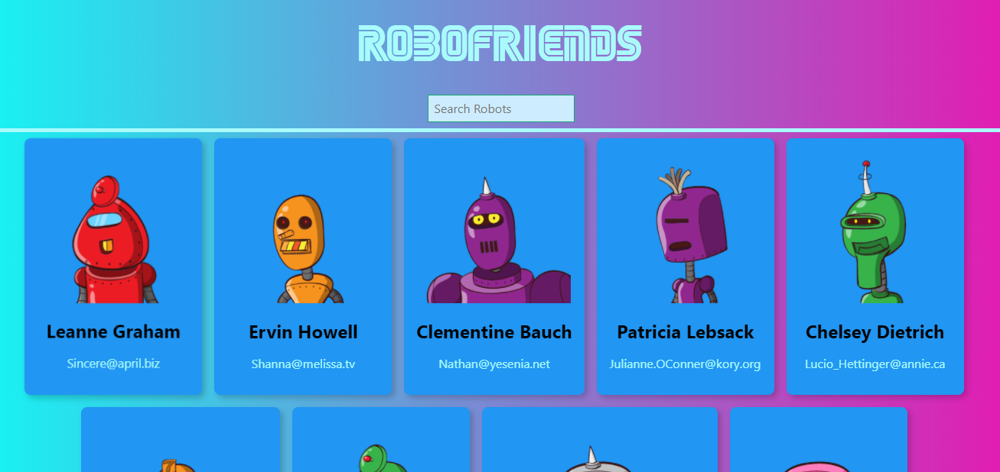

# `Robofriends A React JS Project `

The project is build with react, it fetches random robots from https://robohash.org/ and fetches user through an API from Api placeholder. Robots can be filtered by searching in the searchbox.

## In the project directory, you can run:

### 1. `Clone this repo`

### 2. `npm install`

### 3. `npm start`

Runs the app in the development mode. 
Open [http://localhost:3000](http://localhost:3000) to view it in the browser.
